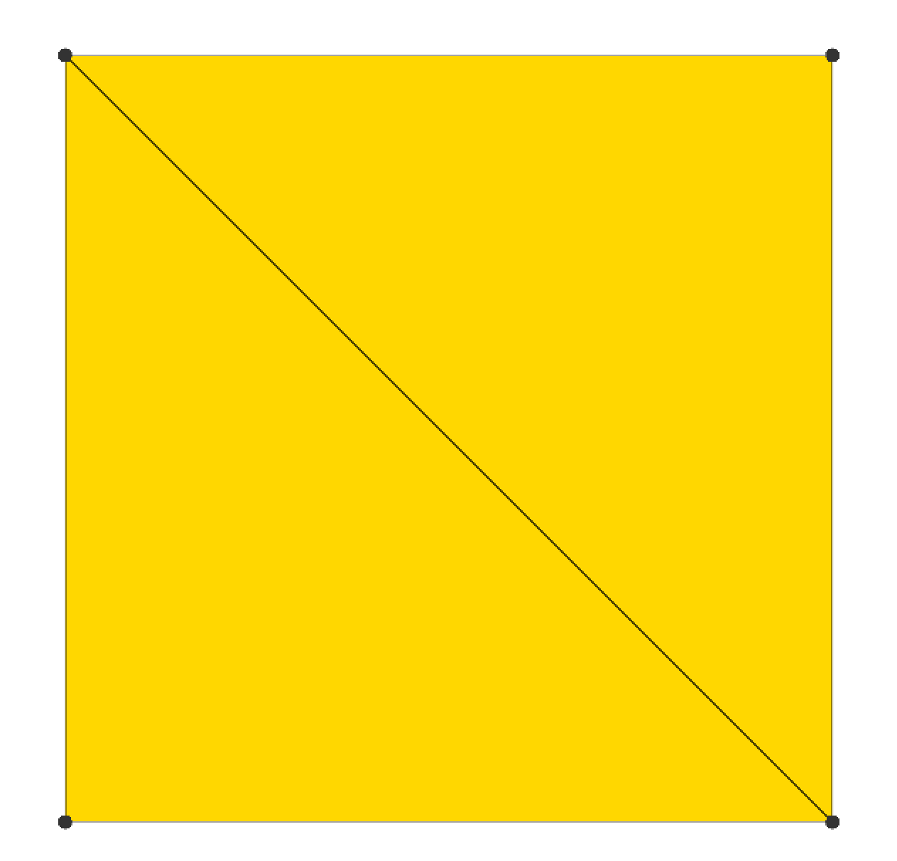
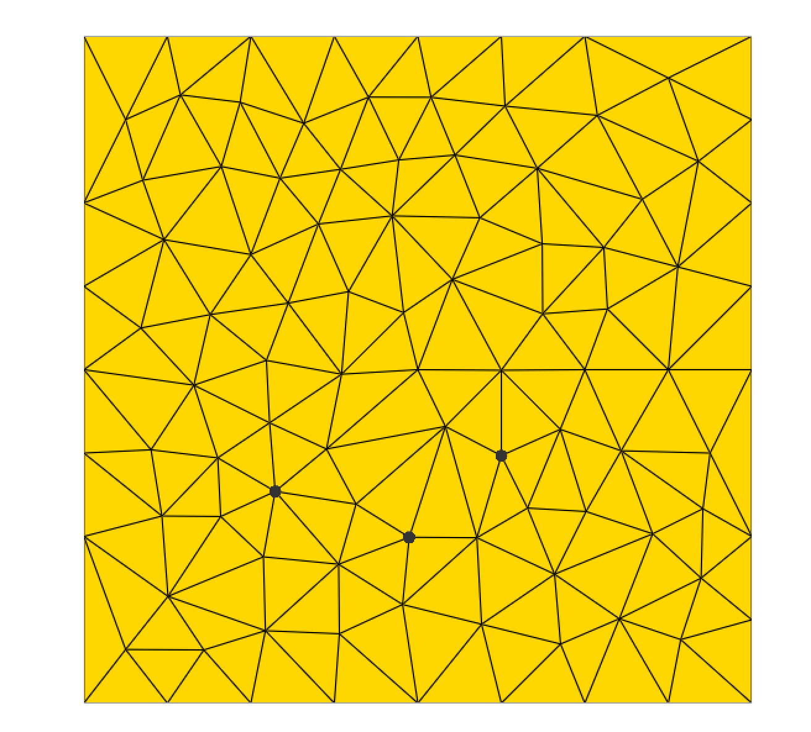
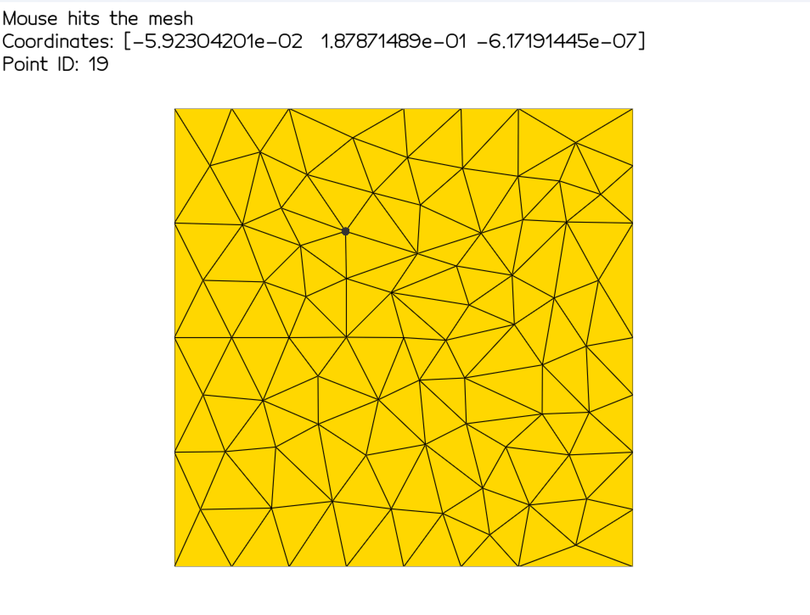
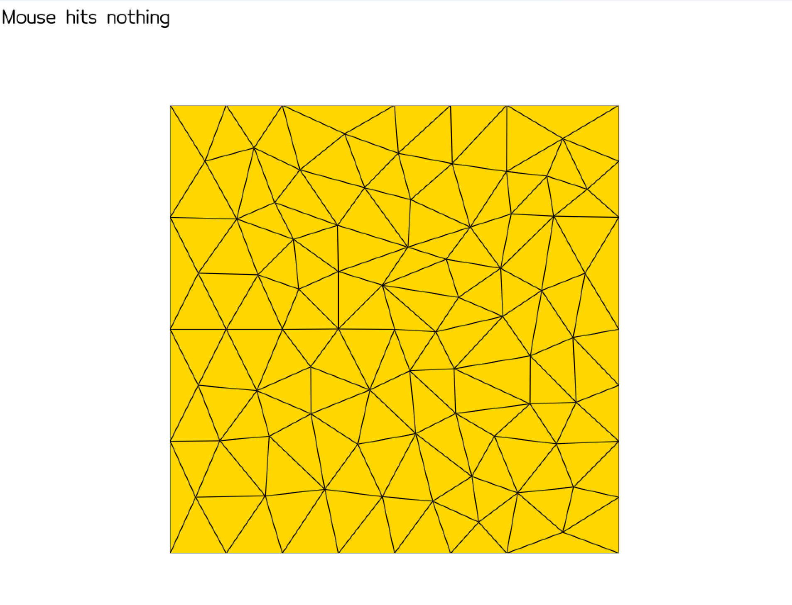
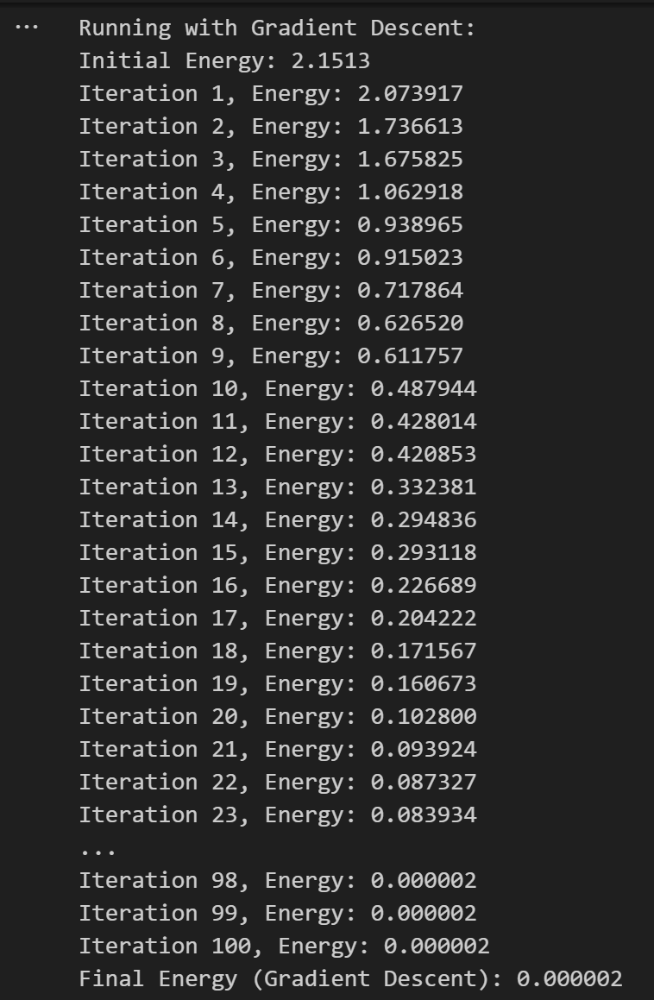
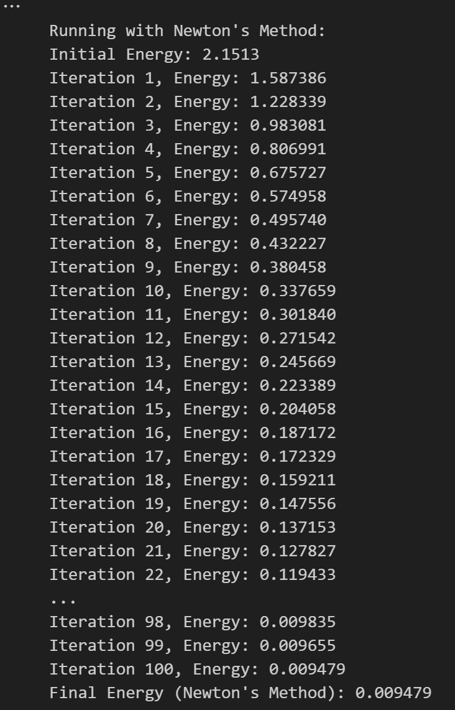
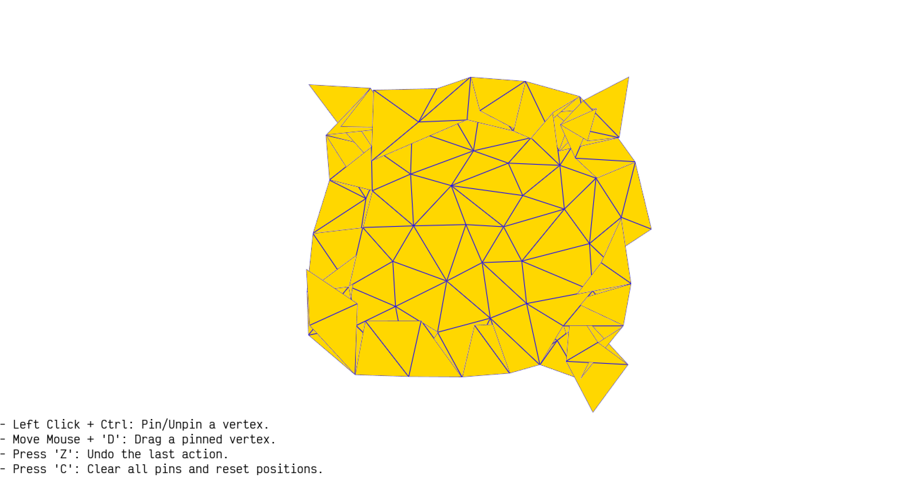
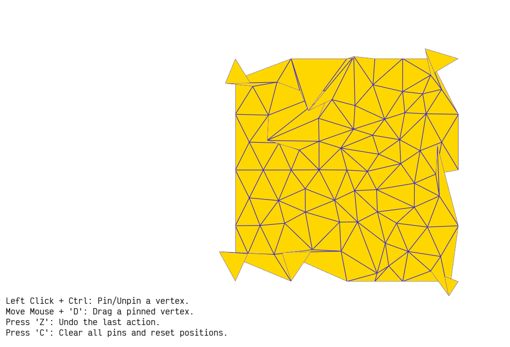
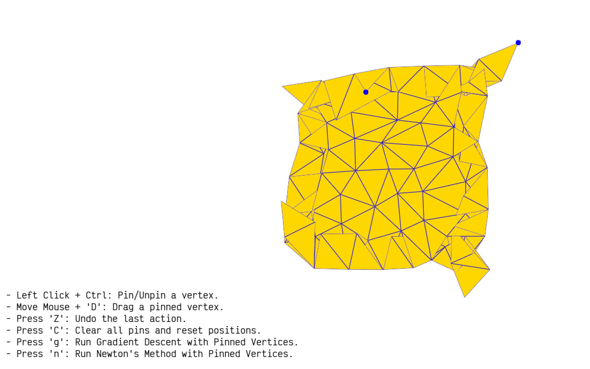
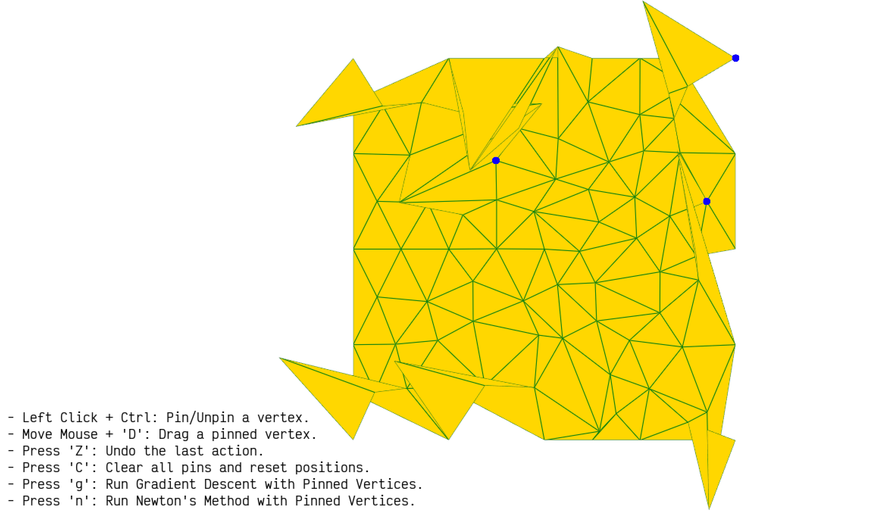

# Assignment 2 Report   Deformation

**Name**: Adan Sulimany  

## Task 1: Create a mesh for the simulation

### 1- Create a different shape, other than the square in the sample code. Show it in the report. Be creative!

I created a Star mesh to replace the default square. The shape consists of two interlocking triangles: one pointing upward and the other downward. Each triangle was defined using its vertices, and the `triangle` package triangulated their interiors. The vertices and faces were then visualized using the `vedo` library.

Below is the visual representation of the Star:

  

 

### 2- Read the documentation of Triangle and figure out how to create a triangulation with no interior vertices and with approximately 100 vertices. Show the results in the report.

**Triangulation with No Interior Vertices:**

After a simple research, I found that to create a triangulation with no interior vertices using the Triangle library, the `p` flag is essential. This flag ensures that the triangulation only uses the vertices provided as input and does not add any interior vertices.

Triangulation Result - No Interior Vertices:

  

 

  

 

**Triangulation with Approximately 100 Vertices:**

to create a triangulation with approximately 100 vertices, the `qaX` flags can be used,
which `q` ensures quality by enforcing a minimum angle for the triangles and `aX` controls the maximum area of triangles to indirectly adjust the number of vertices.
I found that The `qa0.009` enforce a quality triangulation with a maximum triangle area of 0.009.
This value was determined experimentally to produce 102 vertices.

Triangulation Result - 102 Vertices:

  

 

  

 

## Task 2: Implement Basic UI for Moving Points

### 1- Instead of printing to Jupyter (IPython), change the code such that it prints to the Vedo Window. This will make it easier to debug problems. Show an image in the report

To achieve this, I introduced a Text2D object, `message`, which dynamically updates and displays interaction information directly in the Vedo window. This replaces the console print statements, allowing messages such as mouse hit status, clicked coordinates, and the closest point ID to appear within the visualization window.

**Interaction Messages Displayed in the Vedo Window:**

  

 

  

 

### 2- Building on top of the basic functionality shown above, implement a mechanism that would allow the user to pin vertices and move pinned vertices to new locations. There are countless approaches for doing that. Make your own, and be creative! Remember you can use keyboard modifiers (Shift, CTRL, ALT, etc.) to change what happens when you click on an object with the mouse. Explain your interface in the report and add images/clips that could illustrate it if necessary.

The interface I implemented allows users to interact with vertices on a mesh in a dynamic and intuitive way. By combining mouse actions and keyboard modifiers, the user can pin vertices, drag them to new locations, undo changes, and reset the mesh.
To ensure ease of use, the interface includes an on-screen guide that clearly lists all available shortcuts, such as Ctrl + Left Click for pinning and 'd' for dragging.

1. **Pinning and Unpinning Vertices:** 
The interface enables users to pin vertices by holding `Ctrl and clicking` on them. Once pinned, the vertices are visually highlighted in red. Clicking a pinned vertex again while holding Ctrl will unpin it, restoring it to its default state.
---
2. **Moving Pinned Vertices:** 
Pinned vertices can be moved by holding the `d` key and dragging the mouse. Movement is smooth and intuitive, with the vertex staying locked to the user's mouse until the 'd' key is released. To maintain consistency, the movement is restricted within the bounds of the original square polygon, preventing any distortion of the mesh structure. The vertex's position is updated live, with clear on-screen feedback showing its new coordinates.
---
3. **Undoing Actions:** 
Users can press `z` to undo their most recent action, whether it's pinning, unpinning, or moving a vertex. The interface uses a stack to track all actions, allowing users to perform multiple undo operations in sequence. Feedback messages indicate what action was undone, ensuring transparency.
---
4. **Clearing All Changes:** 
The `c` key clears all modifications, resetting the mesh to its original state. This action removes all pinned vertices and restores moved vertices to their initial positions, effectively acting as a reset button. A confirmation message is displayed to inform the user of the reset.
---

**Interactive Mesh Manipulation: Pin, Drag, Undo, and Reset in Action**

  <video controls width="500">
    <source src="screenshots/video.mp4" type="video/mp4">
  </video>

  

## Task 3: Test the optimization pipeline
### 1-  FEMMesh Optimization Without Pinned Vertices
First of all, the provided code contained multiple errors and inconsistencies that did not align with the task requirements, including incorrect method calls, dimensional mismatches, and issues with the energy, gradient, and Hessian calculations. To address these, I debugged the code and adjusted it to work specifically in 2D by ensuring consistent handling of 2D mesh configurations and numerical stability. With the help of **ChatGPT**, I overcame these challenges and ensured the code met the task's objectives effectively.

To fulfill this task,, I created a `FEMMesh` using the given triangular mesh, the `ZeroLengthSpringEnergy` energy function, and the `EdgeStencil` to define the mesh's local element structure. Then, I initialized an optimizer by calling `optimizer = MeshOptimizer(femMesh)`.  
The optimization was run iteratively using both **Gradient Descent** and **Newton's** Method, and after each iteration, the mesh was rendered to visually observe its deformation. At each step, the energy value and the updated mesh positions were recorded to monitor progress.

To ensure that no pinned vertices interfered with the optimization process, I explicitly cleared the `pinned_vertices` list before starting by calling `pinned_vertices.clear()`. With no pinned vertices, the mesh was free to deform naturally, governed solely by the energy minimization process. As a result, the mesh collapsed toward its barycenter, minimizing the `ZeroLengthSpringEnergy` function, which pulls all vertices together to a single point. This behavior visually confirmed the expected outcome for an unconstrained optimization.

I expect to see the energy values decrease steadily as the optimization progresses. Without any pinned vertices, the mesh should deform freely and collapse toward its barycenter due to the nature of the `ZeroLengthSpringEnergy` function, which minimizes the distances between connected vertices. **Gradient Descent** is expected to exhibit a smooth, step-by-step reduction in energy, while **Newton's** Method should converge more quickly, leveraging its second-order optimization strategy. Both methods should eventually stabilize as they approach a minimum energy configuration.

**Below are the results of the optimization process using Gradient Descent and Newton's Method:**

- Gradient Descent Results:

  

 

- Newton's Method Results:

  

 

**Based on the results:**
1. **Energy Convergence:** 
Gradient Descent started with an initial energy of 2.1513 and reached a final energy of 0.000002 after 100 iterations. 
Newton's Method also started with the same initial energy but reached a final energy of 0.009479 after 100 iterations.

1. **Rate of Convergence:** 
Newton's Method demonstrated faster energy reduction in the early iterations, significantly outperforming Gradient Descent in the first 20 steps. 
However, Gradient Descent's steady convergence eventually achieved a much lower final energy.

1. **Mesh Behavior:** 
Both methods led the mesh to collapse toward its barycenter, consistent with the behavior expected from the ZeroLengthSpringEnergy function.

**Mesh Shrinking: Gradient Descent vs. Newton's Method**

  <video controls width="500">
    <source src="screenshots/video2.mp4" type="video/mp4">
  </video>

### 2- Try to do the same with `SpringEnergy` and show in the report. Note that since the gradient and Hessian methods are not implemented, they are computed using finite differences.

I do the same task with SpringEnergy and show the results. Since the gradient and Hessian are not implemented, I used finite differences to compute them. This method estimates the derivatives by slightly perturbing the values and measuring the changes in the energy. It is slower but works well when analytical derivatives are missing.

**Gradient Descent:**

- I started with an initial energy of 2.1513.
- After 100 iterations, the final energy was reduced to 0.017589.
- The energy kept decreasing steadily, showing good convergence, though it took many iterations to reach a low energy.

  

**Newton's Method:**

- The initial energy was also 2.1513.
- After 100 iterations, the final energy reached 0.335031.
- Newton’s Method started strong with fast reductions in energy but got stuck at a higher energy compared to Gradient Descent. This is likely because the Hessian, computed using finite differences, was not very accurate.
  

In the results, I also show how the mesh deforms as the energy decreases. Gradient Descent achieved better results overall, but it required more iterations to reach convergence. Newton’s Method was faster in the beginning but less reliable in this case.

- Gradient Descent:

  

 

- Newton's Method:

  

 

### 3- Enable pinning vertices. This can be done in a veriaty of ways. One simple approach is to change x after each iteration, such that the elements in x that correspond to the fixed vertex match its coordinates. In other words, if vertex number i is fixed to the coordinates (xi,yi), then after each iteration do `x(i) = xi` and `x(i+self.nV) = yi`. Optional: explain the flaw with this approach and propose a better one. Show the result in the report.

I implemented the functionality to enable pinning vertices during the mesh optimization process. This was achieved by allowing dynamic pinning using Ctrl + Left Click, where the selected vertices were added to a pinned_vertices list. During optimization, the pinned vertices were kept fixed while the other vertices adjusted to minimize the energy.

For the optimization, I tested both Gradient Descent and Newton's Method:

In Gradient Descent, the pinned vertices' positions were enforced after each iteration by resetting their coordinates to their original values using the apply_pinned_constraints method.
In Newton's Method, I incorporated the constraints directly into the gradient and Hessian computations. Specifically, I zeroed out the rows and columns of the Hessian matrix corresponding to the pinned vertices and preserved the diagonal values to maintain stability.
The results showed that both methods successfully optimized the mesh while keeping the pinned vertices fixed. Pinned vertices were highlighted in blue in the visualizations. Gradient Descent adjusted the mesh iteratively, while Newton's Method converged faster, demonstrating its efficiency.

- Gradient Descent:

  

 

- Newton's Method:

  

 

### 4- Optional: Implement the missing gradient and Hessian of `SpringEnergy` and compare the performance of the analytical derivatives with the numerical (finite differences) derivative.

I implemented the missing gradient and Hessian of SpringEnergy analytically. The analytical gradient and Hessian were derived based on the spring energy formulation and incorporated into the optimization process. 