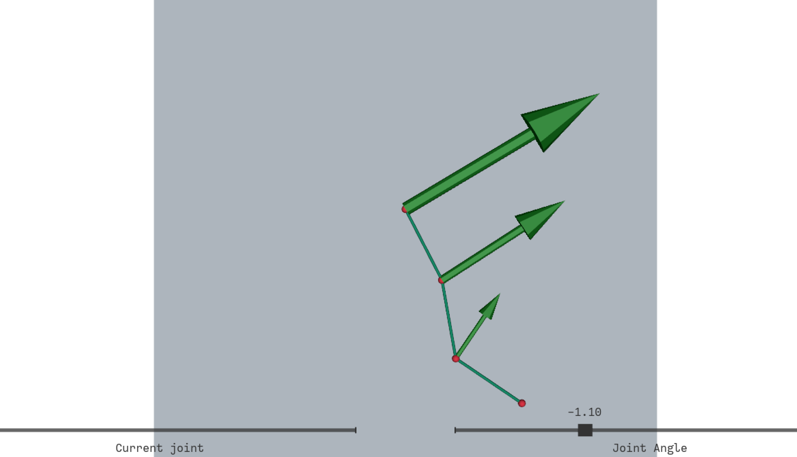

# Assignment 3 Report <br> Kinematics

**Name**: Adan Sulimany  

## Task 1: Extend the implementation of the FK function to any number of joints.


### 1- Change `SimpleArm` such that the constructor can accept different link lengths. Set the link length to some arbitrary length of your choice and change the robot pose in the GUI. Add an image to the report.

**The Changes That I Made:**
- **Added link_lengths Parameter:**
The SimpleArm constructor now accepts variable link lengths, defaulting to unit lengths if not specified.

- **Updated Joint Positions:**
Local joint positions (Jl) are calculated based on cumulative link lengths, ensuring flexibility in arm configuration.

- **Enhanced Forward Kinematics:**
The FK function computes joint world positions (Jw) dynamically using the provided link lengths.

- **Maintained Default Behavior:**
If no link_lengths are given, the arm retains its original unit-length functionality.

**Default Configuration (Unit-Length Links):**
<br>
<div style="text-align:center">
  
</div>
<br>

**Custom Link Lengths ([1.5, 3.0, 1.0]):**
<br>
<div style="text-align:center">
  
</div>
<br>

**Dynamic adjustment of joint angles using the GUI slider:**
<br>
<div style="text-align:center">
  
</div>
<br>

### 2- The FK method computes the position of each joint in world coordinates explicitly. Change the code such that the FK can support any number of joints by replacing the computation by a loop. Create an arm with an arbitrary number of joints, pose it, and add the result to the report.

I updated the `FK` method to use a loop, allowing it to compute joint positions dynamically for any number of joints:
```python
    for i in range(1, self.n + 1):
        Ri = Rot(self.angles[i - 1], [0, 0, 1]) @ Ri
        self.Jw[i, :] = Ri @ (self.Jl[i, :] - self.Jl[i - 1, :]) + self.Jw[i - 1, :]
```

I created a 6-joint robotic arm with custom link lengths, adjusted its pose, and captured the following screenshots:

**Initial Pose: The arm lying flat with 6 joints**
```python
    arm = SimpleArm(n=6, link_lengths=[1.2, 1.0, 0.8, 1.5,1.3,1.1])
```

<div style="text-align:center">
  
</div>

**Dynamic Pose: The arm after adjusting joint angles.**
```python
    arm = SimpleArm(n=6, link_lengths=[1.2, 1.0, 0.8, 1.5,1.3,1.1])
    arm.FK(angles=[0.2, -0.5, 0.8, -1.0, 0.3, 0.4])
```

<div style="text-align:center">
  
</div>


## Task 2: Gradient descent based IK (the Jacobian transpose method)


### 1- Implement the VelocityJacobian method in SimpleArm. Check that your implementation is correct by visualizing the columns of the Jacobian. Explain your reasoning in the report.

- **Implementation:** I implemented `VelocityJacobian` to calculate the Jacobian matrix, where each column represents the contribution of a joint's rotation to the end effector's velocity.

- **Visualization:** To check that my implementation is correct, I implemented `draw_with_jacobian` to render the arm and add arrows for the Jacobian columns. The arrows originate from the joints, showing the direction and magnitude of each column.<br><br>
**Arm with Jacobian Arrows - Initial State:**

<div style="text-align:center">
  
</div>

- **Validation:** By adjusting the joint angles using sliders, I observed that the Jacobian arrows dynamically update in direction and magnitude. This confirms the implementation is correct, as the arrows consistently align with the expected influence of each joint on the end effector's velocity.<br><br>
**Arm with Jacobian Arrows - Dynamic Update:**

<div style="text-align:center">
  
</div>

### 2- Implement the IK method in SimpleArm using gradient descent and adapt the GUI accordingly. Try to make your implementation as robust as you can. Explain your implementation choices in the report

I implemented the `IK` method using gradient descent to iteratively adjust the joint angles:
- Used Forward Kinematics (FK) to compute the current position of the end effector.
- Minimized the Euclidean distance between the current position and the target.
- Calculated the Velocity Jacobian to determine how joint angles affect the end effector's movement, adding damping to ensure stability in singular configurations.
- Dynamically adjusted the learning rate based on the distance to the target for faster convergence and precision.

I enhanced the `LeftButtonPress` function to handle target selection dynamically. It now checks if the target is reachable, on the boundary, or unreachable. For unreachable targets, it clamps the target to the boundary and shows a white sphere; for boundary targets, it displays a yellow sphere; and for reachable targets, it uses a blue sphere. The function integrates the IK method to move the arm to the target and provides real-time feedback messages in the GUI, improving interaction and visualization.

**Console Output: Testing Targets with IK Implementation.**<br>
This shows the results of testing multiple targets, including reachable, unreachable, and boundary scenarios, with the computed joint angles, final positions, and errors.

<div style="text-align:center">
  
</div>

**GUI Visualization: Target and Arm Position.**<br>
The GUI displays the arm reaching a target within the workspace (blue target sphere) along with the feedback message indicating the target's status.

<div style="text-align:center">
  
</div>


**Interactive Inverse Kinematics Demonstration Video:**<br>

<div style="text-align:center">
  <video controls width="450">
    <source src="screenshots/video.mp4" type="video/mp4">
  </video>
</div>

### 3- Add several images demonstrating IK to your report. In particular, experiment with placing the IK target beyond what the arm can reach. Explain what you see.
   
In this task, I tested the Inverse Kinematics (IK) method by placing the target in three different scenarios:

1. **Reachable within the workspace**
2. **Exactly on the workspace boundary**
3. **Beyond the workspace boundary**

The results for each scenario are as follows:

---

#### **Scenario 1: Target Reachable Within the Workspace**
- **Description**: The target is within the reachable area of the arm.
- **Observation**: The arm successfully adjusted its joints to align with the target. A blue sphere is displayed at the target position, indicating it is reachable.

  <div style="text-align:center">
    
  </div>

---

#### **Scenario 2: Target Exactly on the Workspace Boundary**
- **Description**: The target is placed at the exact boundary of the workspace, where the maximum arm reach matches the target distance.
- **Observation**: The arm adjusted its joints to align with the target. A yellow sphere is displayed at the target position, indicating that it lies exactly on the workspace boundary. The feedback confirms this state.

  <div style="text-align:center">
    
  </div>

---

#### **Scenario 3: Target Beyond the Workspace Boundary**
- **Description**: The target is placed outside the workspace, beyond the maximum reach of the arm.
- **Observation**: The target is clamped to the nearest point on the workspace boundary. A white sphere is displayed at the clamped position, indicating the arm cannot reach the target directly. The arm aligns to this clamped position, and the feedback confirms the target was unreachable.

  <div style="text-align:center">
    
  </div>

<br>

## Task 3: Gauss-Newton based IK (the Jacobian inverse method)

### 1- Add the option to use Gauss-Newton instead of gradient descent in `IK` and adapt the GUI accordingly. Pick a target pose and take screenshot of several consequtive iterations and add them to the report. How did the progression of IK change with respect to gradient descent? Explain in the report


I added **Gauss-Newton** optimization as an alternative to Gradient Descent in the IK method, allowing users to switch dynamically between the two via GUI buttons. The IK method now accepts a `method` parameter to choose the optimization technique, with the GUI updated to display the selected method and handle interactions seamlessly.

To observe the arm's progression, I updated the visualization to show intermediate iterations of the IK process. This allows us to see the arm's movement toward the target in real-time.

To visually illustrate the differences between Gradient Descent and Gauss-Newton optimization methods, I recorded the arm's progression toward the target in two scenarios: a reachable target and an unreachable target. The videos show how each method handles these cases and highlight their respective behaviors.

<div style="text-align:center">
  <video controls width="500">
    <source src="screenshots/video2.mp4" type="video/mp4">
  </video>
</div>
<br><br>

The following log demonstrates the number of iterations required for each method to converge when a reachable target was selected:

 <div style="text-align:center">
    
  </div>

This comparison highlights the significant difference in convergence speed between the two methods. Gauss-Newton's faster convergence is particularly advantageous for scenarios requiring quick adjustments, while Gradient Descent remains more robust and consistent across various conditions.


### 2- Cases where the robot posseses more than 2 joints are said to be *redundant*, meaning there are extra degrees of freedom, and that the IK solution is not unique. Propose an approach to define a unique solution.

To handle redundancy in robots with more than 2 joints, I propose leveraging the extra degrees of freedom to satisfy both the primary task (achieving the target position) and additional meaningful objectives. Redundancy can be resolved creatively by defining constraints or optimization goals that prioritize the robot's efficiency, adaptability, and functionality.

**Optimize for Efficiency:**
- I suggest minimizing joint movements by choosing the configuration that is closest to the robot's rest posture. This not only saves energy but also avoids unnecessary wear on the joints.

**Secondary Objectives:**
- Use the redundant degrees of freedom to fulfill secondary goals:
  - Obstacle Avoidance: Ensure the joints adjust dynamically to avoid collisions in the workspace.
  - Posture Control: Favor natural or pre-defined postures (e.g., "elbow up") to make the robot’s motion intuitive and predictable.

**Regularization for Stability:**

- Introduce a regularization term in the IK solver to guide the solution toward configurations that keep the robot far from singularities and joint limits, ensuring both stability and flexibility for future motions.

**Null-Space Optimization:**

- Exploit the null-space of the Jacobian to prioritize secondary tasks (like maintaining a camera orientation or balancing an external load) without affecting the primary IK goal.


By combining efficiency, secondary objectives, and null-space optimization, we can define a unique and practical solution for redundant robots. This approach not only resolves ambiguity but also ensures the robot operates reliably, avoids unnecessary motion, and is better equipped to adapt to dynamic environments.