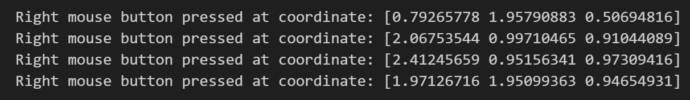
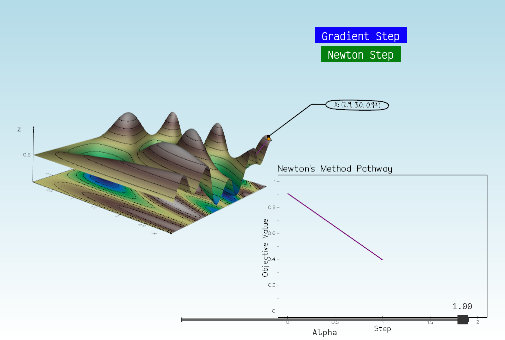

# Assignment Report

**Name**: Adan Sulimany  

## Task 1: Understand the Code

### 1- Mouse Right Button Callback:
Add a callback for a mouse right button press that creates a visual marker (a white sphere) at the clicked location and prints the coordinates to the console. Additionally, the path color changes every time the right mouse button is pressed.

**Steps**:
1. **Defined the Callback Function**:
   - Created the `OnRightButtonDown` function to handle right mouse button events. This function creates a white sphere at the clicked location and prints the coordinates to the console. It also changes the color of the path.

    ```python
    def OnRightButtonDown(evt):
    global current_color_index
    pt = evt.picked3d
    if pt is not None:
        print(f"Right mouse button pressed at coordinate: {pt}")
        sphere = vd.Sphere(pos=pt, r=0.05, c='white', alpha=0.5)
        plt.add(sphere)
        current_color_index = (current_color_index + 1) % len(path_colors)
        new_color = path_colors[current_color_index]
        update_arrow_colors(new_color)
        plt.render()
    ```
2. **Created the update_arrow_colors Function**
   - Added the `update_arrow_colors` function to change the color of all stored arrows when the right mouse button is pressed.

    ```python
    def update_arrow_colors(color):
    for arrow in arrows:
      arrow.color(color)
    ```

3. **Saved All Paths**
   - Modified the `OnMouseMove` function to store all the paths created during mouse movement. This ensures that every path segment is saved and can be updated when the right mouse button is pressed.
    
    ```python
    arrows.append(ar)  # store the arrow
    ```

4. **Registered the Callback**:
   - Added the callback to the Vedo plotter to ensure it gets called on right mouse button presses.

    ```python
    plt.add_callback('RightButtonDown', OnRightButtonDown)
    ```

**Screenshots**:<br>
- Before pressing the right mouse button:
<div style="text-align:center">
  
</div>
<br>

- After pressing the right mouse button:
<div style="text-align:center">
  
</div>
<br>

- Console output after pressing the right mouse button:
<div style="text-align:center">
  
</div>


### 2- Adding a Graph of Function Values:
I added `update_graph` function which it dynamically update and visualize the function values along the path (stored in the Xi array) as we interacts with the plot using the mouse.
- Using **vedo.plot**: The graph is displayed as a 3D plot, which it interfere with the 3D visualization and it not be positioned as desired.
<div style="text-align:center">
  
</div>

- Using **vedo.plot.clone2d**: Converts the 3D plot into a 2D plot, allowing it to be positioned and sized within the main plotter window without interfering with the 3D visualization.
<div style="text-align:center">
  
</div>


## Task 2: Optimize

### 1- Disable Path Formation by Mouse Movement:
To prevent path formation with mouse movement, I commented out the code lines that append points to Xi and add arrows. This change stops new points and arrows from being created as the mouse moves, while keeping the path code intact for later use in plotting optimization progress :

- prevent forming a path:
``` python  
# Xi = np.append(Xi, [X], axis=0)
```
- prevent adding arrows:
```python
# ar = vd.Arrow(Xi[-2, :], Xi[-1, :], s=0.001, c=path_colors[current_color_index])
# plt.add(ar)  
# arrows.append(ar) 
```
- prevent visual path creation:
```python
# c = vd.Cylinder([np.append(Xi[-1, 0:2], 0.0), Xi[-1, :]], r=0.01, c='orange5')
```

### 2- Add a Left Mouse Button Click Callback:
I added a callback that clears the current path and sets a new optimization candidate at the clicked position.

- Clear Path and Markers: Resets paths and removes previous markers to start fresh.
  
- Set New Candidate: Captures the clicked position, calculates the objective value, and updates the candidate marker.
  
- Visualize New Candidate: A marker (orange sphere) is added at the clicked position to indicate the starting point for further optimization steps.

**Console output example after clicking:**
<div style="text-align:center">
  
</div>

 **UI Output:**
<div style="text-align:center">
  
</div>


### 3- Add a button that runs a single gradient descent step and updates the path:
I added a button to execute a single gradient descent step. Each click on this button adds the next candidate to the path, gradually moving closer to the minimum of the objective function. The process involved the following steps:

- Button Creation: Created a button labeled "Gradient Step" to trigger a single step of the gradient descent.
- Button Action Check: Linked the button press event to `perform_step('gradient')`, ensuring a single optimization step is performed with each press.
- Updating the Path: After each step, the new candidate position is appended to the gd_path, and the graph updates to reflect the objective value at each step.

**After one press of the Gradient Descent button:**
<div style="text-align:center">
  
</div>

**After multiple presses:**
<div style="text-align:center">
  
</div>


### 4- Add a button that runs a single Newton's step:
Similarly to the gradient descent button, I added a button labeled "Newton Step" to perform a single Newton's optimization step with each click. The button press event is linked to `perform_step('newton')`, which updates the path accordingly and shows the progression of Newton's method.

**After one press of the Newton's Step button:**
<div style="text-align:center">
  
</div>

**After multiple presses:**
<div style="text-align:center">
  
</div>


## Task 3: Evaluate

### 1-  Maintain Separate Paths for Gradient Descent and Newton Steps:

To achieve this, I made the following changes to the code:

- **Introduced Separate Paths:**
I added gd_path for Gradient Descent and nm_path for Newton’s Method to maintain independent paths for each optimization technique.

- **Updated `perform_step` Function:**
I modified `perform_step` to update only the relevant path. For example, when the Gradient Descent button is pressed, only gd_path is advanced. Similarly, pressing Newton’s button updates only nm_path.

- **Unified Plot for Both Paths:**
I created the `update_paths_plot` function to display both paths together on the same graph. Gradient Descent is shown in orange, and Newton’s Method is shown in purple, ensuring both paths are clearly visualized with proper axis scaling.

Visualization of Gradient Descent ***orange*** and Newton's Method ***purple*** paths:

<div style="text-align:center">
  
</div>


### 2- Select several points, and plot the value of the objective after enough iterations are performed such that the is no visible difference between iterations.

<div style="text-align:center">
  
</div>

<br>

<div style="text-align:center">
  
</div>

<br>

<div style="text-align:center">
  
</div>

<br>

<div style="text-align:center">
  
</div>

