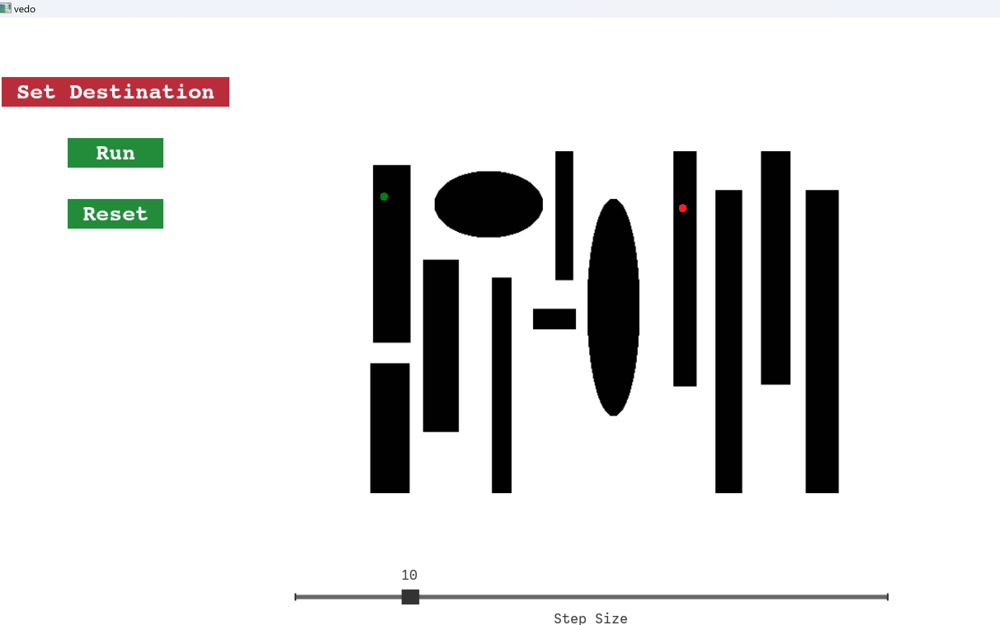
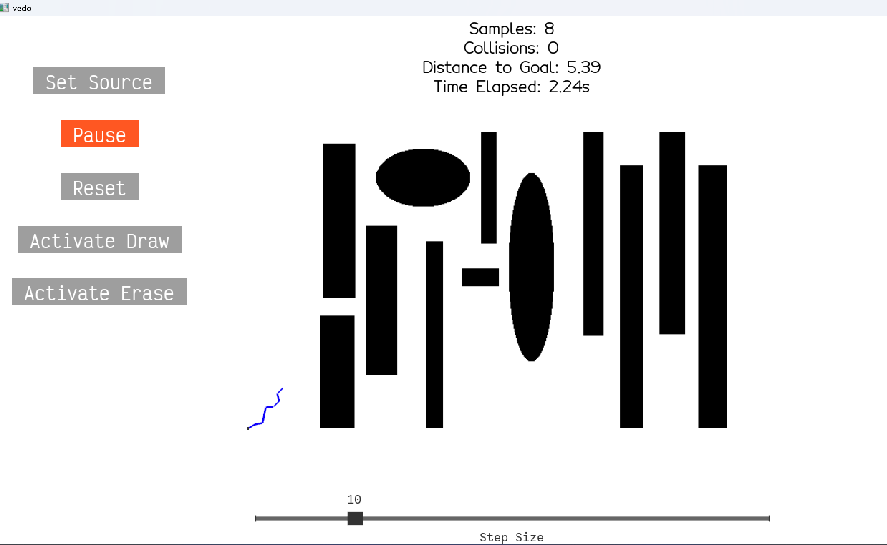
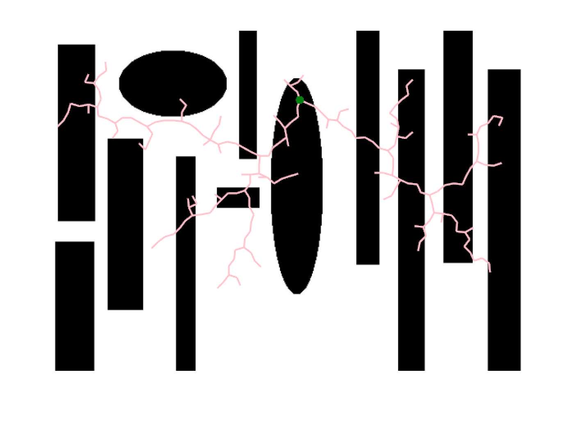
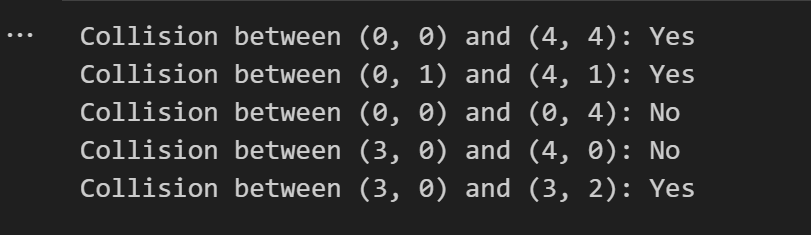
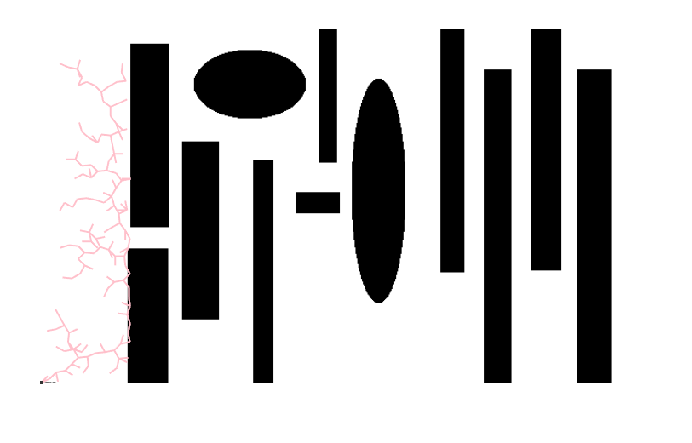
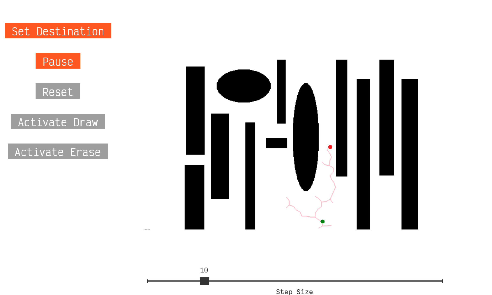
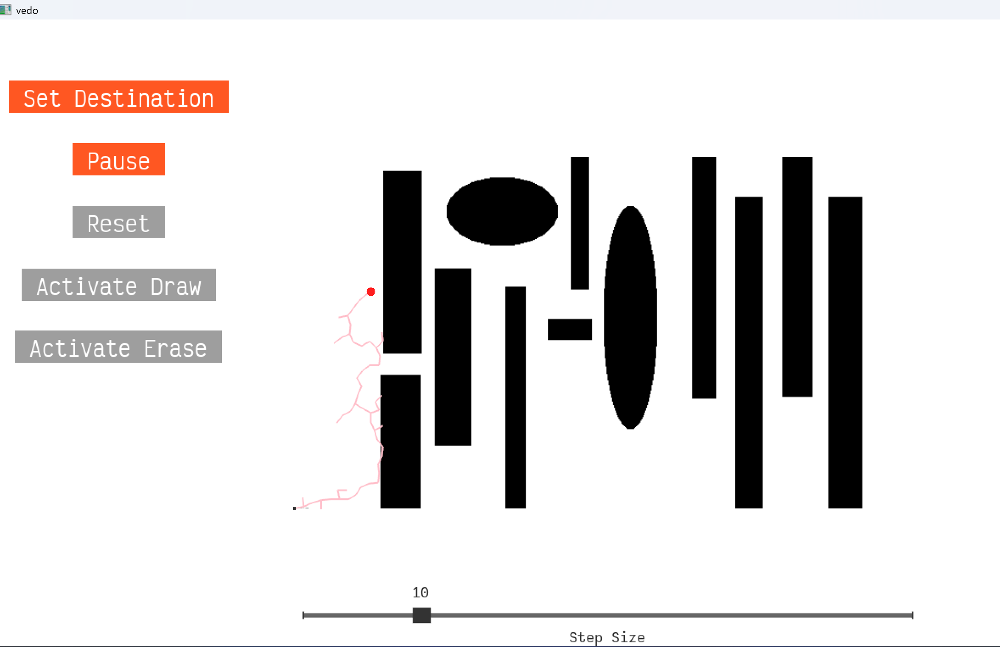
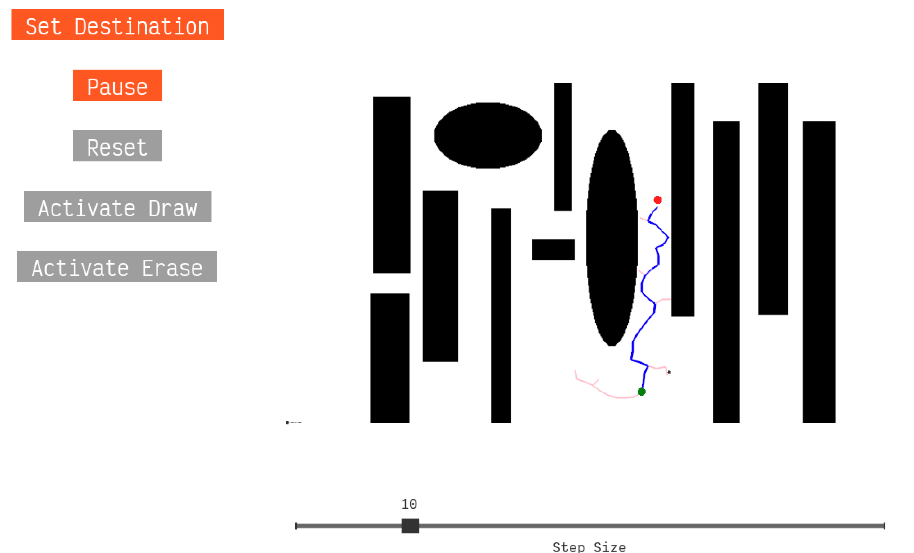

#  Assignment 4: Path Planning with RRT

**Name**: Adan Sulimany  

## Task 1: Complete the GUI

### 1. Add the ability to set the source and destination points. Add a button to reset the tree. Add a slider to change the step size. Place a screenshot of your GUI in the report.

#### Step 1: Setting the Source and Destination Points

I added the ability to set the Source and Destination points dynamically in the GUI:

1. Toggle Between Modes: 
   - A button was introduced to switch between two modes: `Set Source` and `Set Destination`.

2. Right-Click Interaction:
   - In Set Source mode, right-clicking on the scene updates the source point.
   - In Set Destination mode, right-clicking updates the destination point.
   - The latest points are dynamically visualized in the plot as a green circle for the source and a red circle for the destination.

#### Step 2: Resetting the GUI

I added the ability to reset the GUI to its initial state using a Reset Button.

1. Button Implementation:
   - A new button labeled `Reset` was introduced to the interface.

2. Functionality:<br>
    Clicking the Reset button clears the following:
    - Source and Destination Points:
    The previously selected source and destination points are removed from the GUI.
    - Tree Visualization:
      - All tree nodes and edges are removed.
      - The samples list is re-initialized with a default starting point to ensure the algorithm works after a reset.

#### Step 3: Dynamic Step Size Adjustment

I added a slider to the GUI to allow dynamic adjustment of the step size during runtime.

1. Slider Configuration:

    - Range: The slider allows step size values between 1 and 50.
    - Initial Value: The default step size is set to 10.

2. Dynamic Updates:
   - The stepSize variable is updated dynamically whenever the slider is moved.


#### Interactive GUI Demonstrating Source, Destination, Reset Button, and Step Size Slider:

<div style="text-align:center">
  
</div>
<br>


### 2. Add a way to change the obstacle map. You can take inspiration from existing drawing tools (e.g. MS Paint). The goal is not to implement a full-blown drawing tool, but to seel a very simple way to interact with the map. Be creative! Exaplain your approach and add a screenshot or a short clip.

I added two buttons for `Draw Mode` and `Erase Mode` to allow users to modify the obstacle map interactively. Each button is designed to activate or deactivate a specific mode, ensuring that only one mode is active at any given time.

1. Draw Mode:
   - When the "Activate Draw" button is pressed, users can drag the mouse across the map to add obstacles.

2. Erase Mode:
   - When the "Activate Erase" button is pressed, users can remove obstacles by dragging the mouse.

#### Interactive Obstacle Map Editing: Drawing and Erasing in Action

<div style="text-align:center">
  <video controls width="450">
    <source src="screenshots/video.mp4" type="video/mp4">
  </video>
</div>


### 3. Add other means to change the visualization as you see fit. You may return to this step after you made progress on other parts of the assignment. Demonstrate your visualization in the report.

To enhance the user experience and improve the visualization of the RRT algorithm, I implemented several interactive features that allow users to track and adjust the algorithm’s progress dynamically. The key features added are:

- I introduced real-time statistics that display critical information during the execution of the algorithm, such as:
  - Number of samples generated.
  - Number of collisions encountered.
  - Current distance to the destination.
  - Elapsed time since the algorithm started.
- These statistics are updated at each step of the RRT process and provide valuable insights into how the algorithm is progressing.

The visual enhancement and statistics functionality can be seen in the screenshot below. As the algorithm runs, the statistics are dynamically updated. When the user presses the Reset button, both the visualization and the statistics are cleared, allowing for a fresh start.

<div style="text-align:center">
  
</div>
<br>


## Task 1: Implement RRT

### 4. Complete the implementation of getNextSample. The next sample needs to be at `stepSize` distance from the nearest sample. Add a screenshot showing the correct tree (without considering collisions yet).


I completed the implementation of the `getNextSample` function to ensure the next sample is generated at a fixed distance `stepSize` from the nearest existing sample. 

The function identifies the nearest sample using a KDTree for efficiency, calculates the direction vector toward a randomly generated point, normalizes and scales this vector by stepSize to determine the new sample's position, and rounds the coordinates to align with the grid. The new sample is then connected to its parent, forming part of the expanding tree. 

#### Tree Expansion Visualization

<div style="text-align:center">
  
</div>
<br>


### 5.  Implement the `Collision` function. The function accepts the obstacle image as a 2D boolean array `img`, and two points `x1` and `x2`. This function should return true if a straight line path between  `x1` and `x2` with any obstacles. This should be done by finding all of the pixels on that line and checking whether the value in `img` is `True` or `False`. Add the code for the function in the report. In addition, run a sanity check and include it in the report as well.

I implemented the `Collision` function to check for intersections with obstacles along a straight-line path between two points. This was achieved by:

1. Generating all the pixel coordinates along the line connecting the two points using Bresenham's algorithm (`skimage.draw.line`).
2. Iterating through the pixels and checking if any of them lie in an obstacle (False in the binary image).
3. Returning `True` if an obstacle is detected; otherwise, returning `False`.


```python
def Collision(img, x1, x2):
    # Validate input points
    if x1 is None or x2 is None:
        print("Collision Error: Points are None.")
        return True
    # Convert to integer coordinates
    try:
        x1, y1 = map(int, x1)
        x2, y2 = map(int, x2)
    except ValueError:
        print(f"Collision Error: Invalid points {x1}, {x2}")
        return True
    # Generate pixel coordinates along the line
    rr, cc = line(y1, x1, y2, x2)
    # Check each point for collision
    for r, c in zip(rr, cc):
        if 0 <= r < img.shape[0] and 0 <= c < img.shape[1]:
            if not img[r, c]:  # Obstacle detected
                return True
    return False
```

To verify the correctness of the Collision function, I ran a series of tests with both scenarios:

- A line entirely in free space.
- A line passing through an obstacle.

**here is the Sanity Check Code**

```python
test_img = np.array([
    [True, True, True, True, True],  
    [True, False, True, False, True], 
    [True, True, True, True, True],   
    [True, False, False, True, True], 
    [True, True, True, True, True]    
])

simple_tests = [
    ((0, 0), (4, 4)), 
    ((0, 1), (4, 1)),  
    ((0, 0), (0, 4)),  
    ((3, 0), (4, 0)),  
    ((3, 0), (3, 2)) 
]

for x1, x2 in simple_tests:
    result = Collision(test_img, x1, x2)
    print(f"Collision between {x1} and {x2}: {'Yes' if result else 'No'}")

```

**this is the results i get:**

<div style="text-align:center">
  
</div>
<br>


**Pathfinding Visualization Using RRT with Collision Detection in an Obstacle Map**

<div style="text-align:center">
  
</div>
<br>


### 6. Add a stopping condition in `doRRTIteration`. Reason about it in the report.

 I implemented a stopping condition based on two factors:

 1. **Reaching the destination:** The algorithm should stop when the current sample is sufficiently close to the destination point. This is achieved by checking the Euclidean distance between the current sample and the destination. If this distance is below a certain threshold, we can confidently say that the destination has been reached, and the algorithm should terminate.


 2. **Maximum iterations:** To ensure that the algorithm does not run indefinitely, I also added a maximum number of iterations (1500). If the algorithm exceeds this number without reaching the destination, it will stop to prevent unnecessary computation.


The stopping condition is checked inside the doRRTIteration function, where the algorithm performs a step of the RRT process. The key steps of the stopping condition are:

- Distance Check: After generating a new sample, I check if the distance to the destination is smaller than a predefined threshold. If so, the algorithm is halted, and the path is considered found.
  
- Maximum Iterations: I also monitor the number of iterations, and once the threshold of iterations is exceeded, the algorithm stops.


This image shows the RRT pathfinding process, halting once the destination is reached:<br>
(the destination point `red` and the source point `green` are visible)

<div style="text-align:center">
  
</div>
<br>


### 7. Setup an experiment and run it until the destination point is found. Put a screenshot in the report.

The screenshot below shows the result of running the RRT algorithm until the destination point is reached. In this image:

- The `red` dot represents the destination, which is the goal for the algorithm.
- The `pink` path shows the generated trajectory as the algorithm explores the environment and avoids obstacles.
- The dot which represents the source point is the initial point `np.array([0,0])`.
  
<div style="text-align:center">
  
</div>
<br>


The algorithm stops automatically once it reaches the destination, as defined by the stopping condition in the previous task. This experiment demonstrates the algorithm's ability to successfully navigate through the environment, avoiding obstacles, and finding a path from the source to the destination.


### 8. Implement a function to extract the path once the goal is reached. Highlight the path in a different color and show a screenshot in the report.

To fulfill the task of extracting and highlighting the path once the goal is reached, I implemented the `highlightPath` function. This function extracts the path by recursively following the parent nodes starting from the destination and visualizes it by adding a line between each sample node and its parent.

- The function begins with the destination sample and traces back to the source by following the parent property of each sample.
  
- Each step along the path is visualized using a blue line `(vd.Line)`.
  
- The recursion stops once the source node is reached, completing the path extraction.

The image below shows the result of the algorithm with the extracted path highlighted in blue. The `red` dot represents the destination, the `green` dot represents the source, and the `pink` path is the initial trajectory of the algorithm. Once the goal is reached, the `blue` path is drawn from the destination to the source, confirming that the RRT algorithm has successfully found a path.

<div style="text-align:center">
  
</div>
<br>


## Task 3: Experimental results

I conducted experiments to evaluate the RRT algorithm’s performance with different parameters and map types.

**Experimental Setup:**
- Maps: Simple, complex, and random environments.
- Parameters: Step size (10, 20, 50), maximum iterations (100, 500, 1000), and threshold distance (5, 10, 20).
  
**Results:**
- Execution Time: Smaller step sizes took longer, while larger steps were faster but less optimal.
- Path Quality: Smaller step sizes resulted in smoother paths, and larger steps caused detours.
- Success Rate: More iterations improved success in complex maps.
  

**Strengths:**
Efficient in simple environments and adaptable to random setups.

**Weaknesses:**
Struggles with optimal paths in dense environments and performance declines with fewer iterations.

RRT is effective in simple environments but less reliable in complex ones. Parameter adjustments can optimize its performance, though it may not always find the best path in difficult scenarios.
